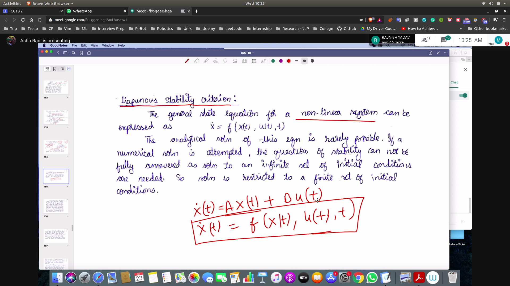
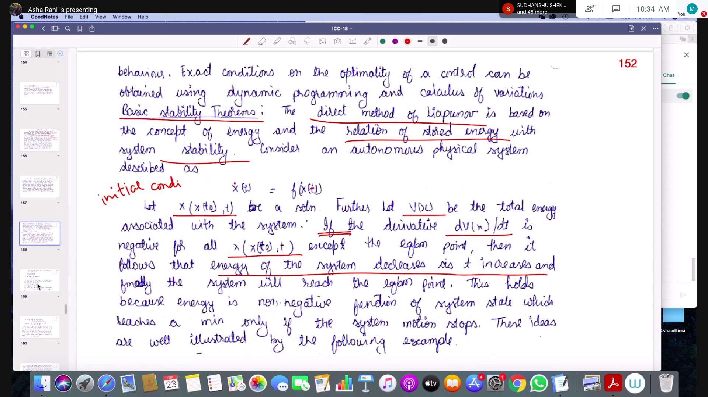
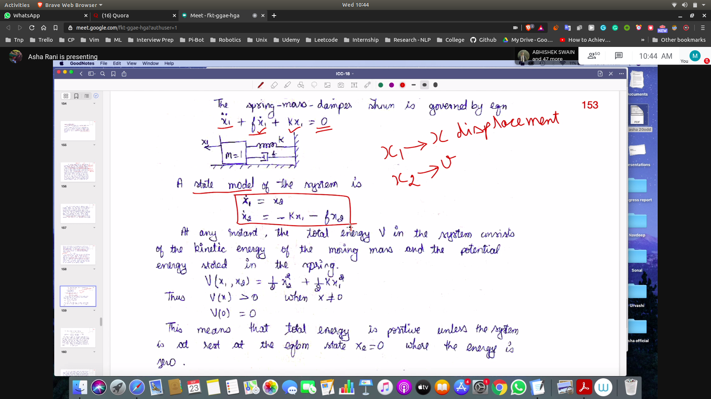
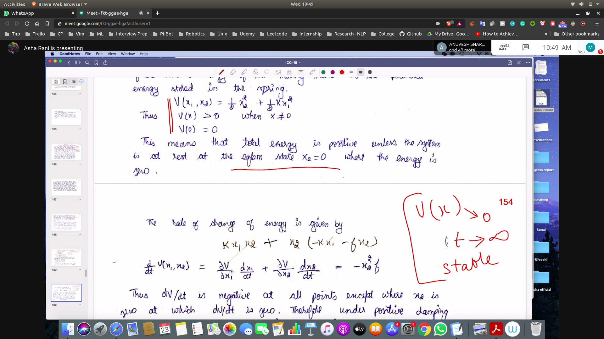
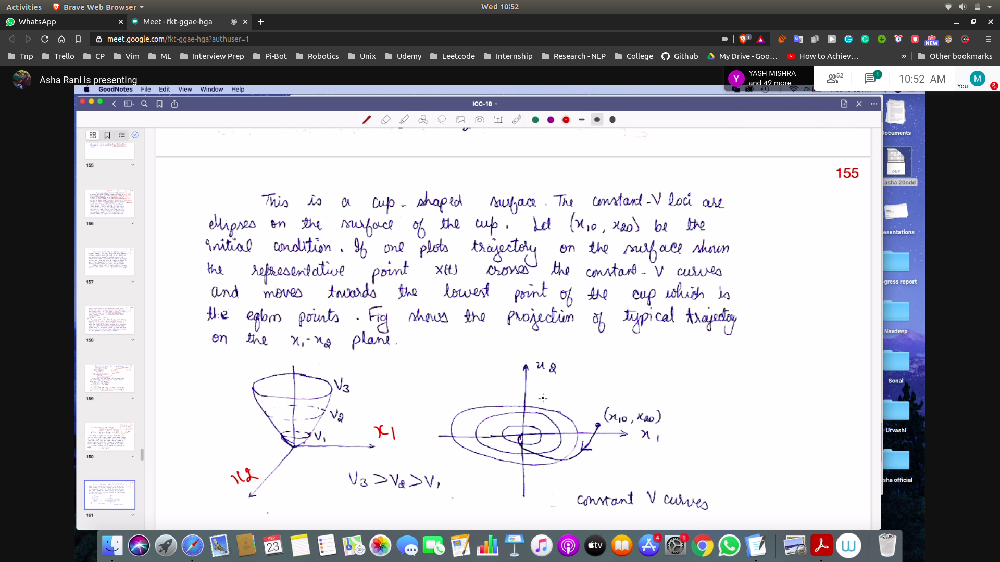

## Liapunous Stability Criteria
- 

- Here also we will be only considering the equiblirium state (ip = 0)
- Here we will non be linearizing but analysing NL system as it is

## Stability of the system
- Stability is Judged in terms of energy 
 - 

## SMD
- 
- To check stability we have to check rate of change of energy of the system
- 
- The rate of change of energy is negative
- Thus it's traj will be
- 
