# Finding Observability

## Using Ackermann's Formula
- 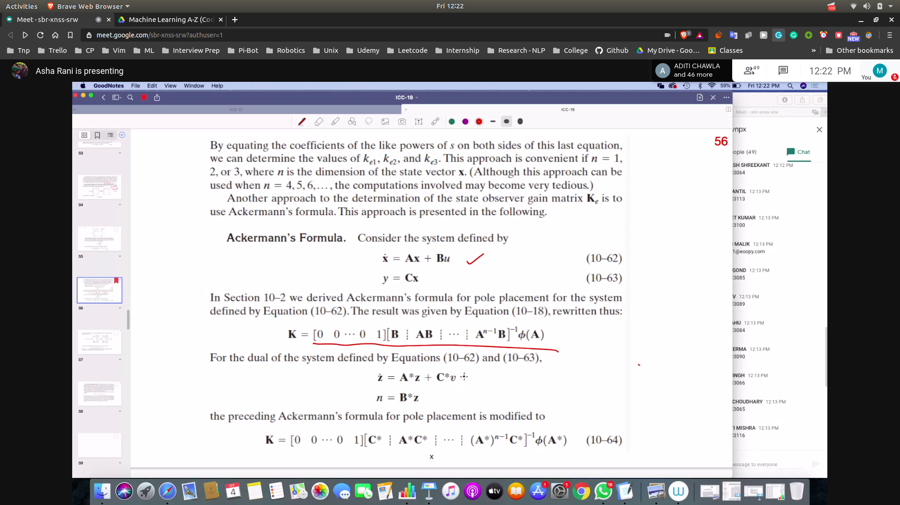
- 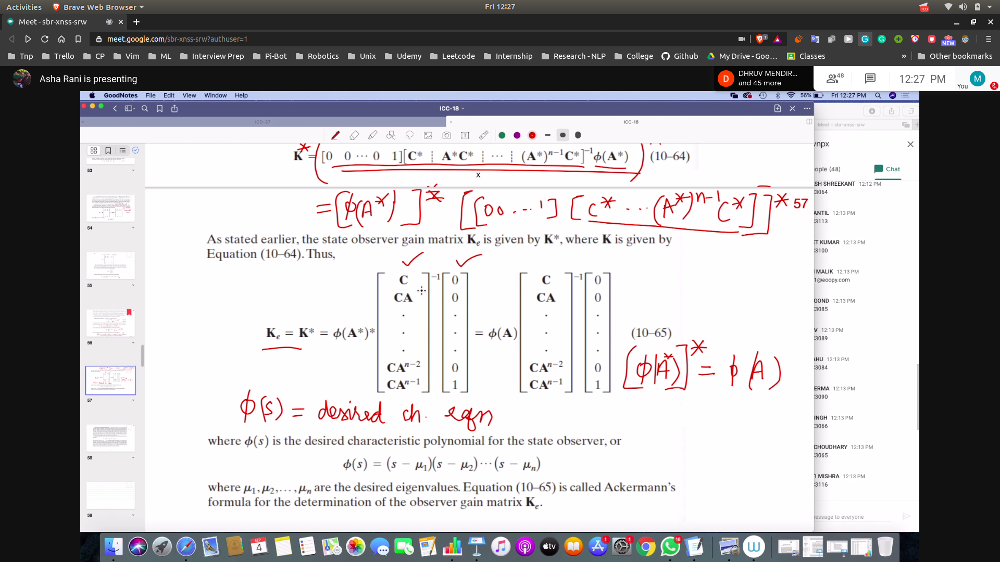

## For finding K_e
- 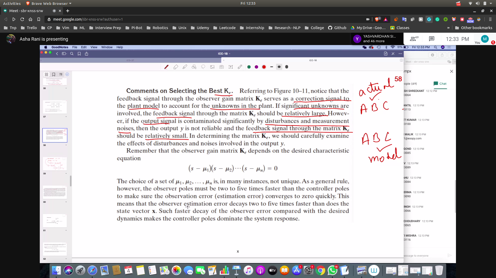
- relation b/w controllalability and observability
- 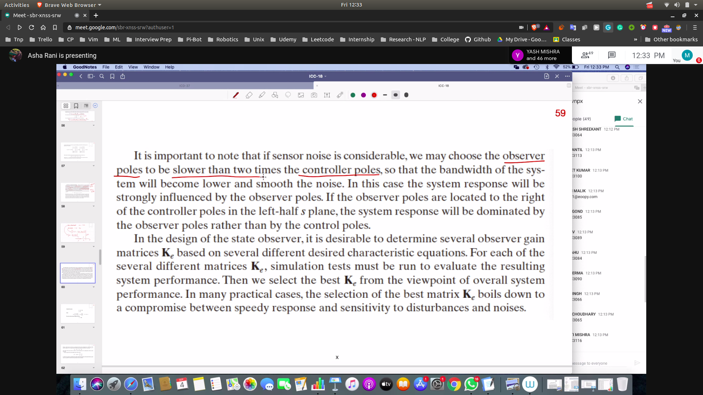

## Process
- given A,B,C
- u = -K (x (observed) )
- 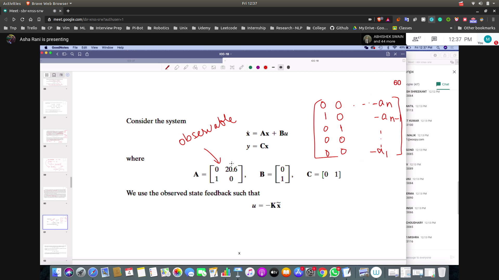
- ve are given desired eigen vector
- then we draw observability matrix
- 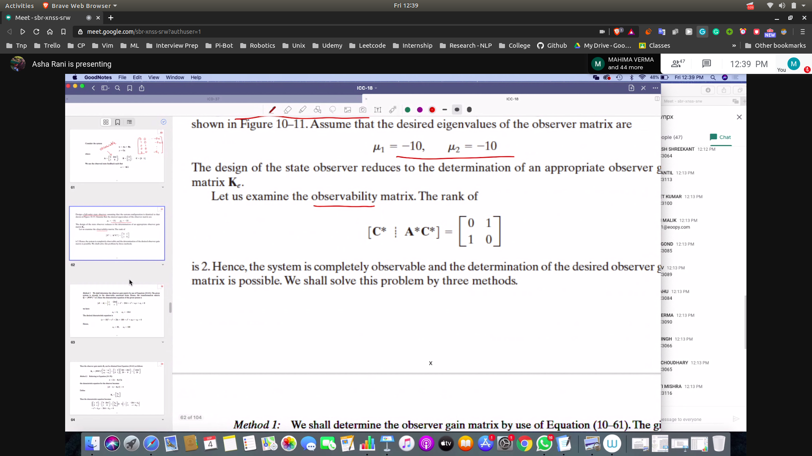
### First Method
- get transformation matrix
- compare to desired characteristic equation
- get the value of coeff
- 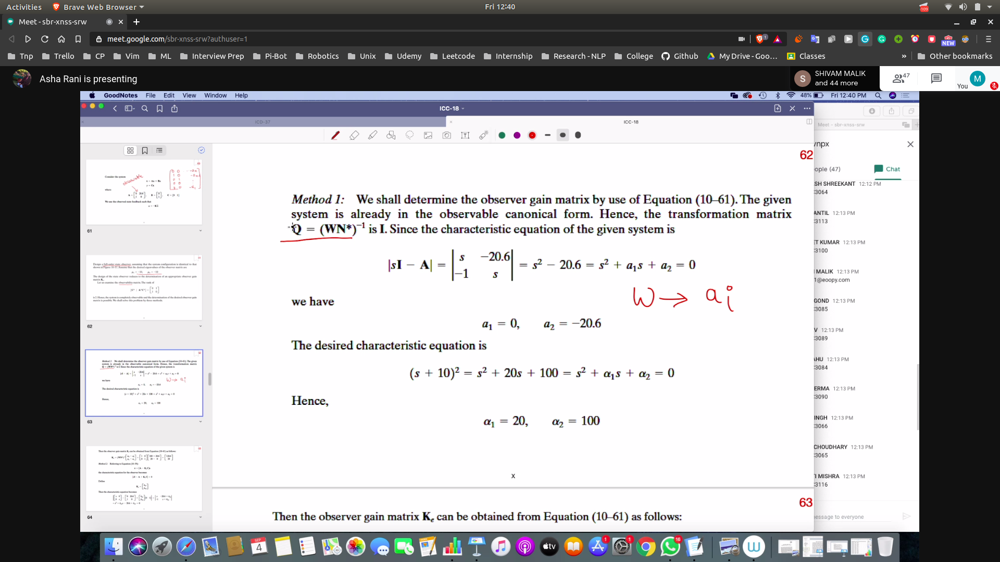
- obtain the K_e by substituing the values to obtain K
- 
### Second Method
- put ke values in e
- 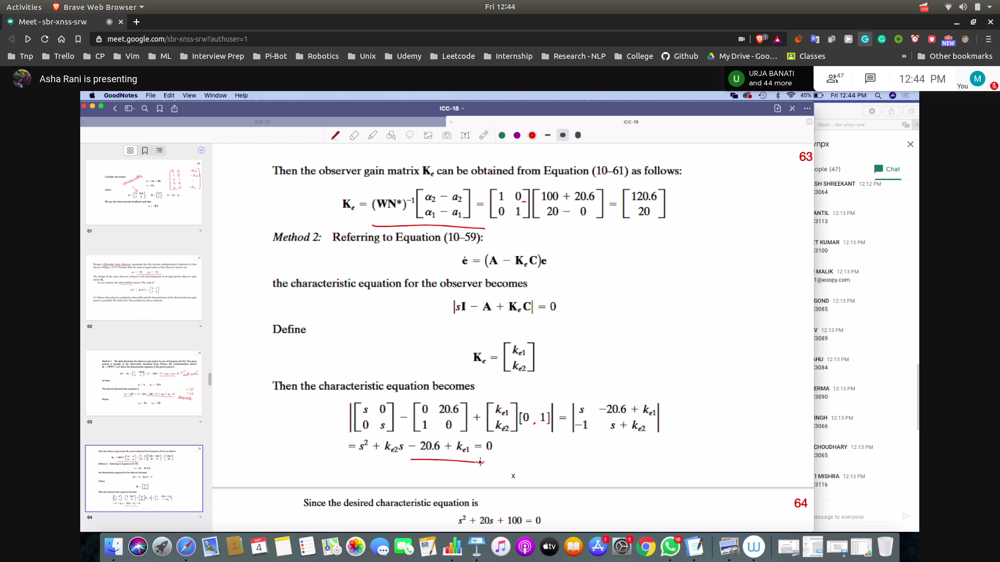
### Third Method
- using the ackermann's formula
- 
### Finally obtain the full state observer eqn
- 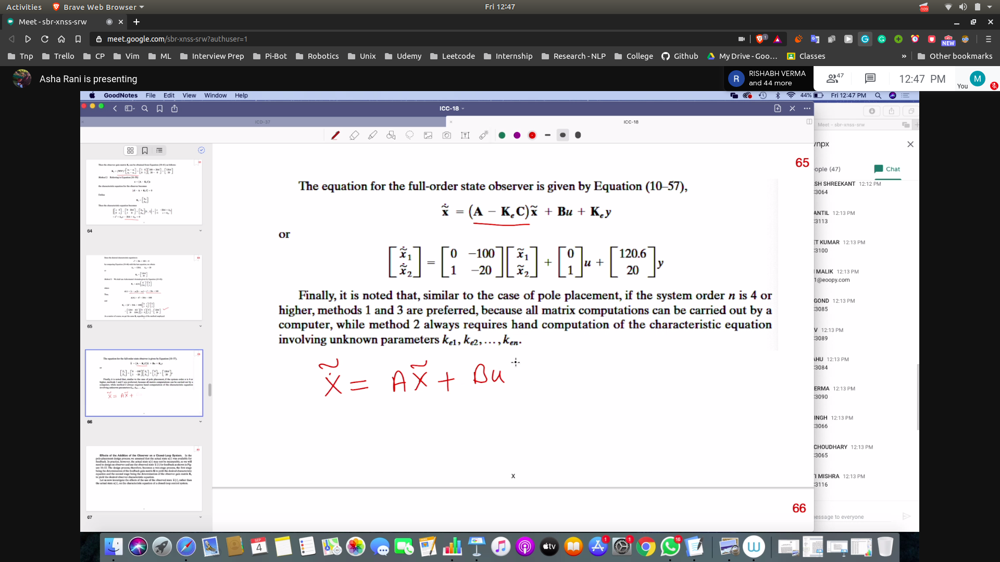

## Effect of addition
- 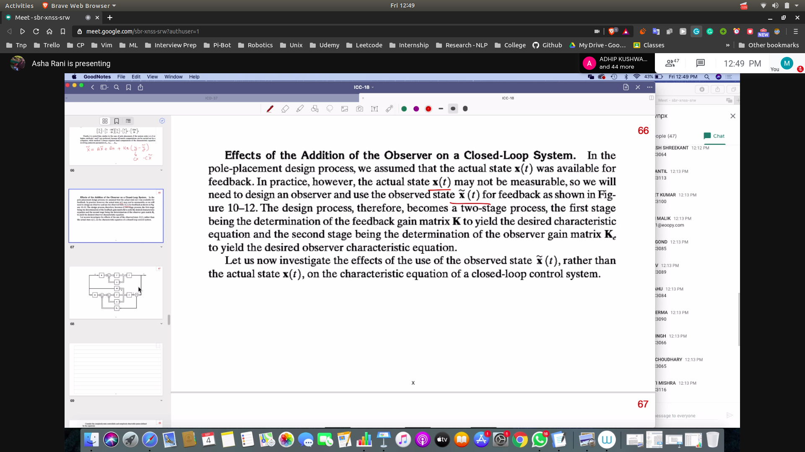
## Full Integrator Circuit
- 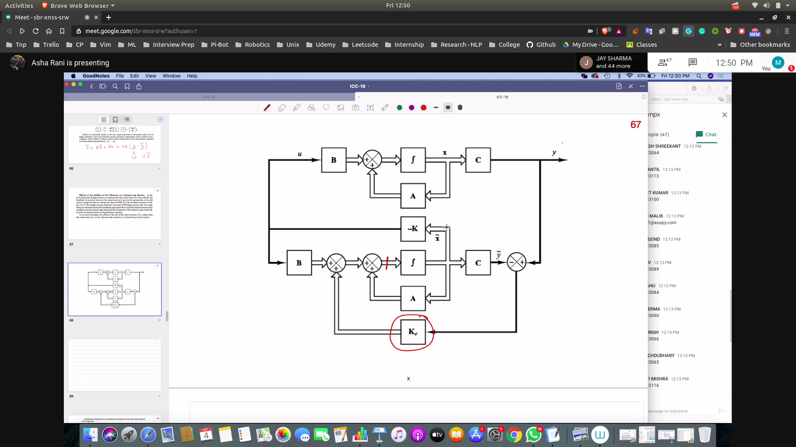
