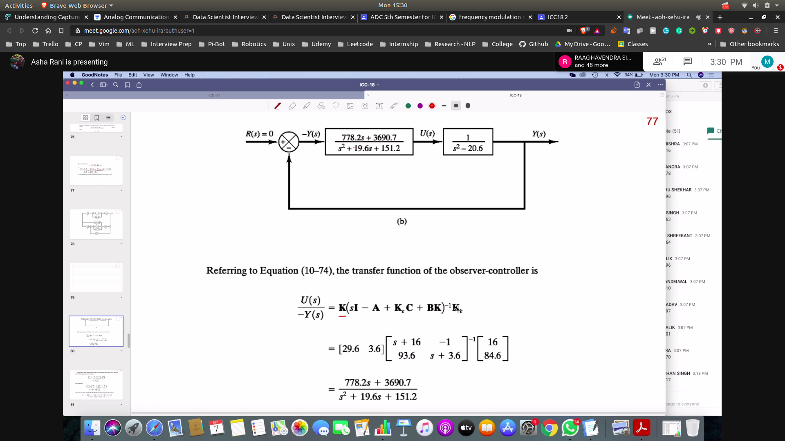
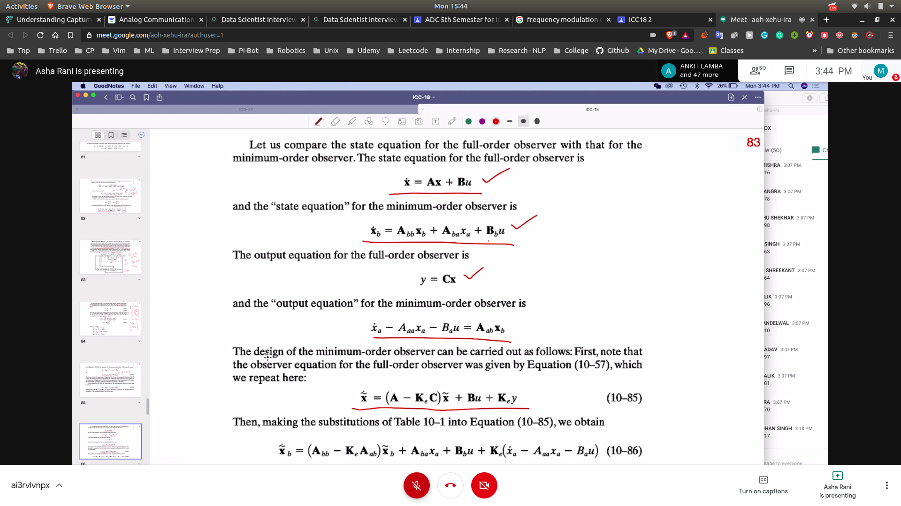

## Effect of Adding an Observer
- 

### Observer Based Controller
- this system is called observed state feedback control system
- 
- tf for the new system
- 
- stability
- 
### Process
- calc observer gain matrix
- then get the x~ matrix ==> observable matrix
- get the block diagram
  - 
- get the observer-controller TF 
  - 
- char eqn of the entire system
  - can also do using the block diagram
  - 

### Response to init conditions
- 

## Minimum Order Observer
- 
- 

## Min vs Full
- 
- 
