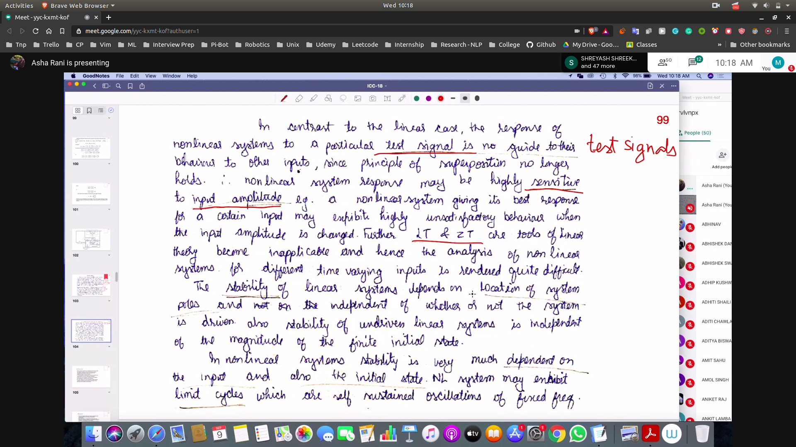
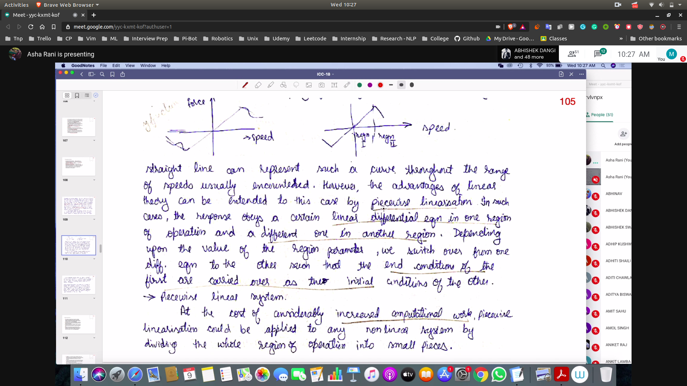
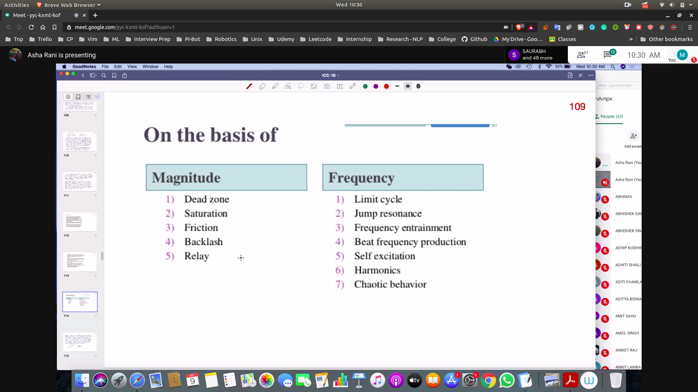
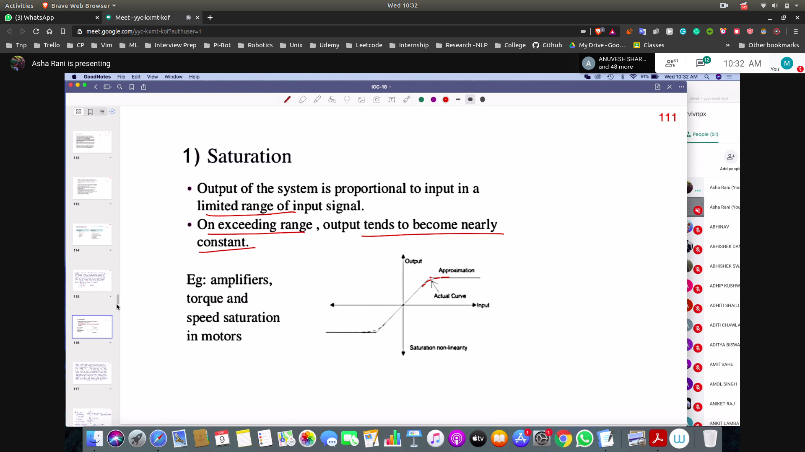
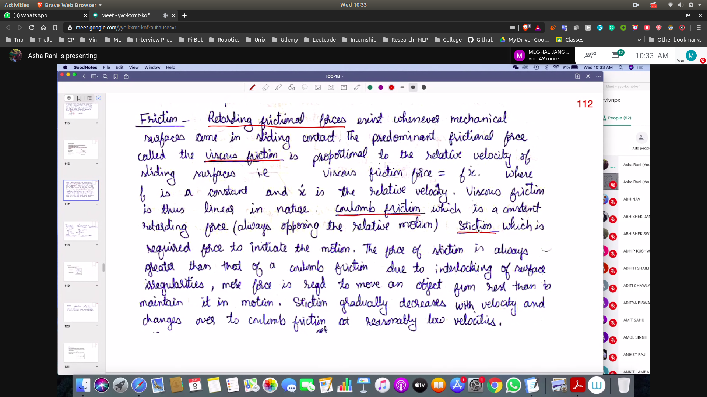
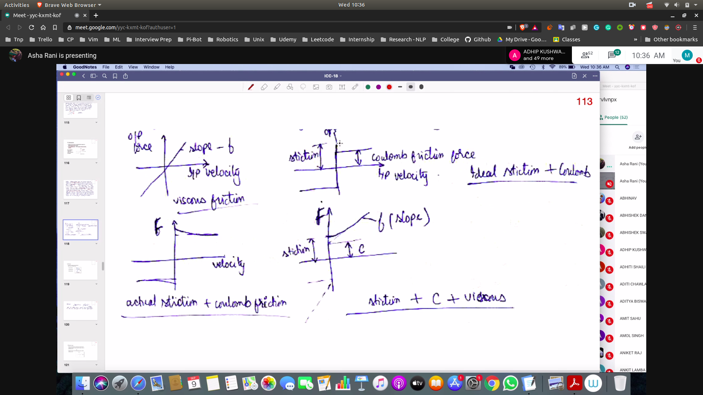
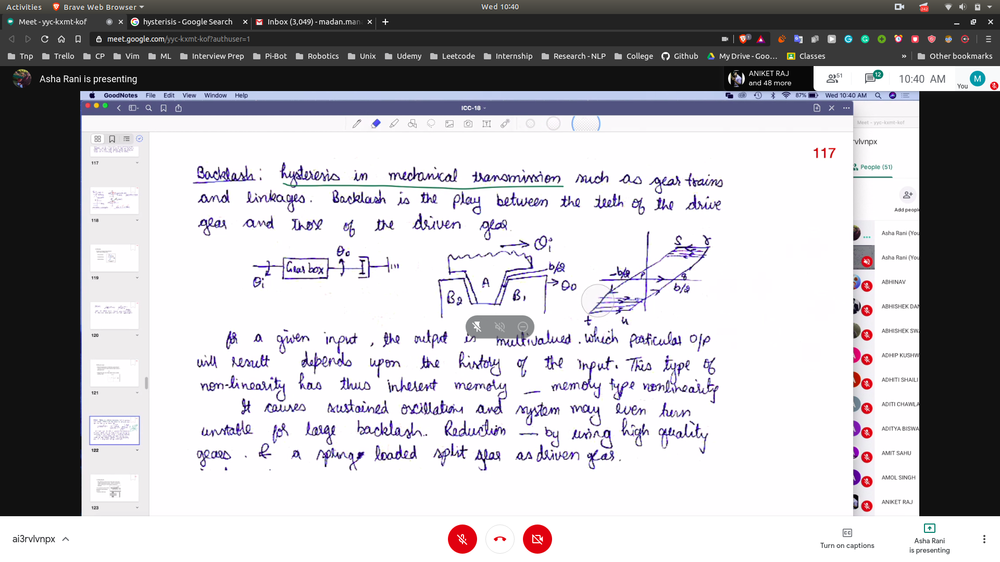
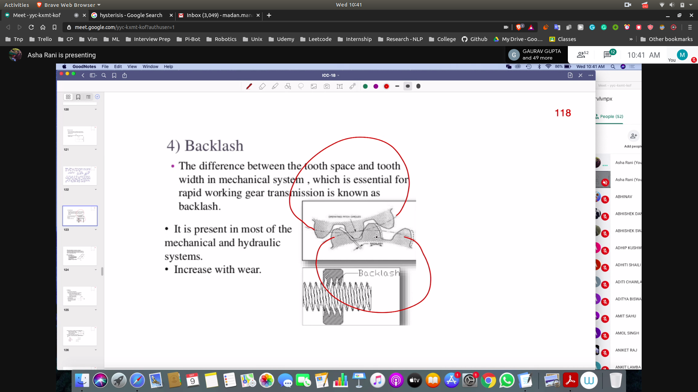

## Non Linear Systems
-> For eg in RC ckt (If R is changing and C is changing then the system is non linear)
## Advantages
- **good operation**

## Intro
- In linear sugnals we used to test with test signals
- But cannot be done with the non-linear system as it does not follows superposition
- non linear system are highly sensitive of highly sensitive to input amplitude
- stability is not defined by system poles
  - stability also depends on initial state
- It also **exhibits limit cycles --> self sustained oscilations**
- 

## Terms --> To be Seen
- Jump Resonance
- SubHarmonic Osciallation
- Limit Cycles
- Asynchrous Quenching

## Classification
- Incidental Non Linearities
  - inherently present in the system
- Intentional Non Linearities 
 - delibrately inserted into the system to modify 

## Investigation of non-linear system 
- 
- We linearise the non-linear system
- In order to approximate the curve we will **peicewise linearize** the curve

## Different Type of Non- Linearities
- 

### Saturation
- 

### Friction
- viscous friction
- coloumb friction
- stiction
- 
- 

## Backlash
- Hysterisis in mechanical transmission 
- 
- 

## Deadzone
